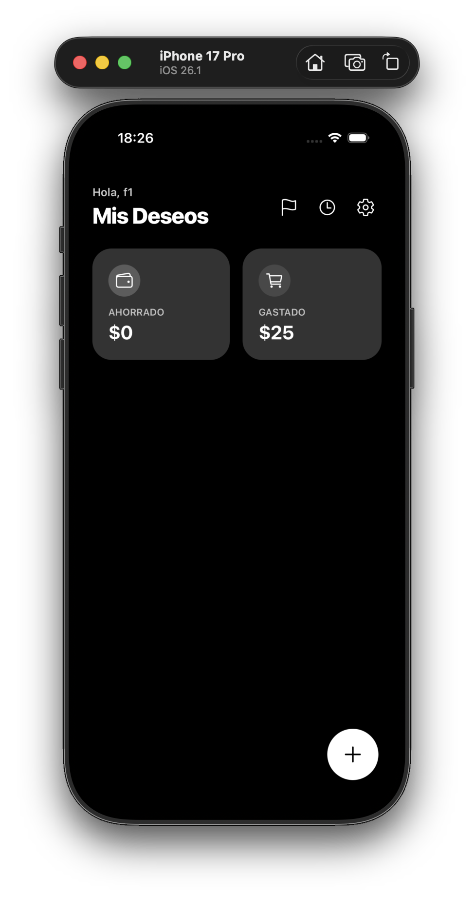
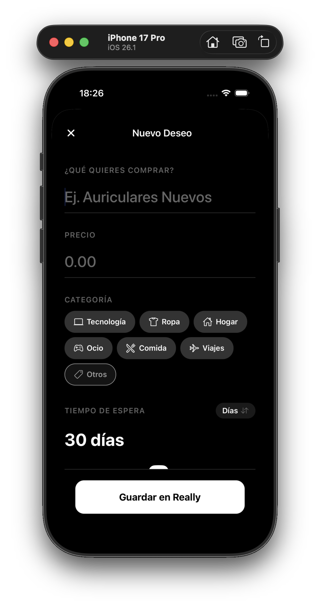
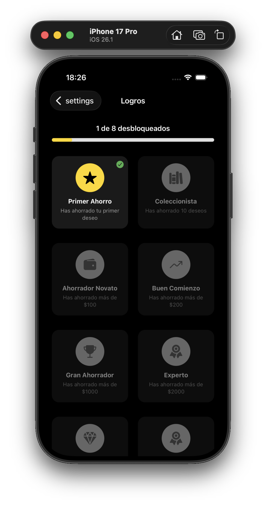
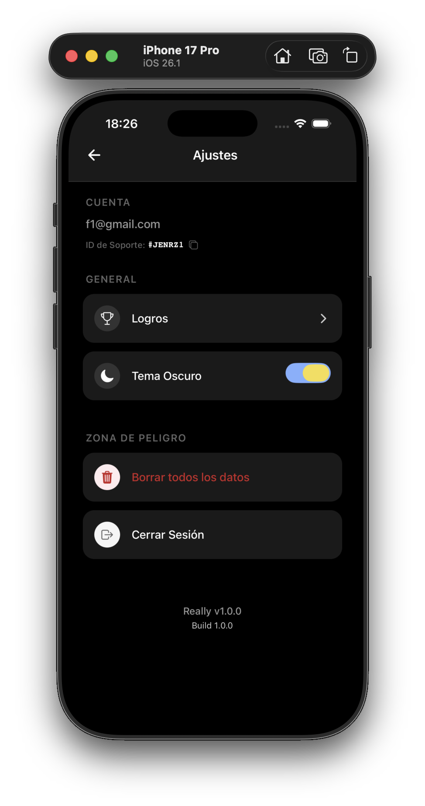

<div align="center">
  
  <h1 style="font-size: 3rem; margin-top: 1rem;">Really</h1>
  <p style="font-size: 1.2rem; color: #666;"><strong>Stop Impulse Buying. Start Saving.</strong></p>

  [](https://expo.dev)
  [](https://reactnative.dev)
  [](https://www.typescriptlang.org/)
  [](https://firebase.google.com/)
</div>

<div align="center">
  <div style="display: flex; flex-wrap: wrap; justify-content: center; gap: 10px;">
    
    
    
    
  </div>
</div>

Una aplicación minimalista y estética diseñada para combatir las compras impulsivas mediante la psicología de la "espera obligatoria".

## 💡 Concepto

Cuando quieras comprar algo, regístralo en **Really**. La app iniciará una cuenta regresiva (tú decides cuánto tiempo, desde minutos hasta días). Al finalizar, te preguntará: "¿Realmente lo quieres?".

- Si la respuesta es **NO**: El precio se suma a tu "Dinero Ahorrado".
- Si la respuesta es **SÍ**: Se marca como comprado y se suma a "Dinero Gastado".

## ✨ Características Principales

### 🚀 Experiencia de Usuario (UX)
- **Onboarding Interactivo**: Guía de bienvenida para nuevos usuarios explicando la filosofía "Añadir -> Esperar -> Decidir".
- **Diseño Premium**: Interfaz limpia con soporte nativo para **Modo Oscuro/Claro**.
- **Gestión Intuitiva**:
    - Borrado de ítems erróneos directamente desde la tarjeta.
    - Acceso rápido al historial desde la pantalla principal.
    - Fecha y hora exacta de creación en cada deseo.

### 📊 Análisis Financiero Avanzado
- **Calendario de Actividad**: Visualiza tus días de gasto vs. ahorro con un calendario interactivo.
- **Estadísticas Detalladas**:
    - Gráficos de barras comparativos.
    - **Récords**: Descubre cuál ha sido tu mayor ahorro y tu mayor gasto.
    - **Promedios**: Analiza tu comportamiento medio por ítem.
- **Categorías Visuales**: Organiza tus deseos con iconos y colores personalizados.
- **Navegación Fluida**: Pestañas para alternar instantáneamente entre vistas de "Ahorrado" y "Gastado".

### 🏆 Gamificación y Metas
- **Metas de Ahorro**: Crea objetivos personalizados (ej. "Viaje a Japón") y asigna tus ahorros disponibles para ver tu progreso.
- **Sistema de Logros**: Desbloquea medallas y títulos (como "Coleccionista" o "Leyenda") a medida que ahorras más dinero y deseos.
- **Feedback Visual**: Barras de progreso animadas y celebraciones al desbloquear logros.

### 🛡️ Soporte y Seguridad
- **ID de Soporte Único**: Generación de un código de soporte basado en el UID para facilitar la asistencia técnica sin comprometer datos sensibles.
- **Copia al Portapapeles**: Facilidad para compartir el ID de soporte.

### ☁️ Nube & Tecnología
- **Sincronización en Tiempo Real**: Datos guardados en Firestore.
- **Notificaciones Locales**: Avisos cuando un deseo está listo para ser decidido.
- **Autenticación Robusta**: Login seguro con validación de contraseñas fuertes.

## 🛠️ Tecnologías

- **Core**: React Native, Expo (Managed Workflow), TypeScript.
- **Navegación**: Expo Router v3.
- **Backend**: Firebase (Auth & Firestore).
- **Componentes Clave**:
    - `react-native-calendars`: Para la visualización de actividad.
    - `expo-clipboard`: Para funcionalidades de soporte.
    - `@react-native-async-storage`: Para persistencia local de preferencias (Onboarding).

## 🚀 Cómo empezar

1.  Instala las dependencias:
    ```bash
    npm install
    ```

2.  Inicia la aplicación:
    ```bash
    npx expo start
    ```

3.  Escanea el código QR con tu móvil (usando Expo Go) o ejecuta en un simulador.

## 📂 Estructura del Proyecto

- `app/`: Pantallas y rutas (incluye `stats.tsx`, `onboarding.tsx`, `history.tsx`).
- `components/`: Componentes UI reutilizables (`ItemCard`).
- `context/`: Estado global (`StoreContext`) y lógica de negocio.
- `assets/`: Imágenes e iconos personalizados.
