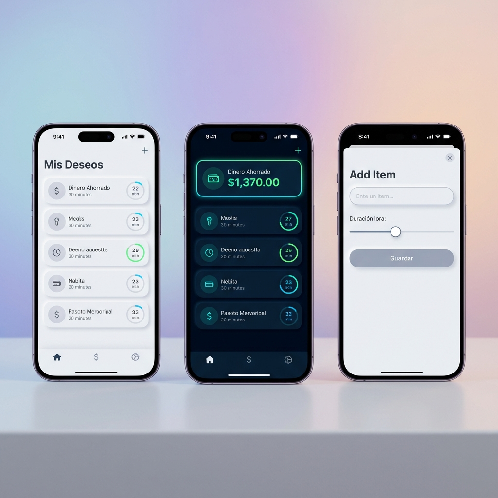

<div align="center">
  
  <h1 style="font-size: 3rem; margin-top: 1rem;">Really</h1>
  <p style="font-size: 1.2rem; color: #666;"><strong>Stop Impulse Buying. Start Saving.</strong></p>

  [](https://expo.dev)
  [](https://reactnative.dev)
  [](https://www.typescriptlang.org/)
  [](https://firebase.google.com/)
</div>

<div align="center">
  
</div>

Una aplicación minimalista y estética para evitar compras impulsivas.

## Concepto

Cuando quieras comprar algo, regístralo en **Really**. La app iniciará una cuenta regresiva (tú decides cuánto tiempo, desde minutos hasta días). Al finalizar, te preguntará: "¿Realmente lo quieres?".

- Si la respuesta es **NO**: El precio se suma a tu "Dinero Ahorrado".
- Si la respuesta es **SÍ**: Se marca como comprado y se suma a "Dinero Gastado".

## Características

### 🎨 Diseño & Experiencia
- **Diseño Aesthetic**: Interfaz limpia, moderna y minimalista.
- **Tema Oscuro/Claro**: Se adapta automáticamente a tu preferencia o puedes cambiarlo manualmente.
- **Animaciones**: Transiciones suaves y feedback visual.

### ⚡ Funcionalidad
- **Temporizador Flexible**: Elige esperar desde 1 minuto hasta 60 días.
- **Historial**: Revisa todas tus decisiones pasadas (compras y ahorros).
- **Estadísticas**: Visualiza cuánto has ahorrado y cuánto has gastado.
- **Notificaciones**: Te avisamos cuando es hora de decidir.

### ☁️ Nube & Seguridad (Firebase)
- **Sincronización**: Tus datos se guardan en la nube (Firestore), accesibles desde cualquier dispositivo.
- **Autenticación Segura**: Registro y Login con Email/Contraseña.
- **Seguridad**:
    - Requisitos de contraseña fuerte (Mínimo 8 caracteres, mayúscula, número, símbolo).
    - Protección contra inyección de código en todos los campos de texto.

## Tecnologías

- **Frontend**: React Native con Expo (Managed Workflow), TypeScript, Expo Router.
- **Backend**: Firebase (Auth & Firestore).
- **Estado**: Context API.

## Cómo empezar

1.  Instala las dependencias:
    ```bash
    npm install
    ```

2.  Inicia la aplicación:
    ```bash
    npx expo start
    ```

3.  Escanea el código QR con tu móvil (usando Expo Go) o ejecuta en un simulador.

## Estructura del Proyecto

- `app/`: Pantallas y navegación (Expo Router).
- `components/`: Componentes reutilizables (ItemCard, etc.).
- `context/`: Lógica de estado global y conexión con Firebase.
- `firebaseConfig.ts`: Configuración de Firebase.
